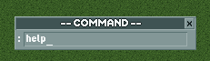

# openrct2-plugin-vim

Vim-style modal keybindings for OpenRCT2.



## How it works

An off-screen window with a focused textbox captures all keypresses in normal mode. This gives you count prefixes, multi-key sequences, etc.

A small indicator window sits above the bottom toolbar. Its title shows the current mode (`-- NORMAL --` or `-- COMMAND --`). In command mode, a textbox appears in the indicator for typing commands.

## Normal mode

### Navigation

| Key | Action |
|---|---|
| `h` | Scroll left |
| `j` | Scroll down |
| `k` | Scroll up |
| `l` | Scroll right |
| `[count]h/j/k/l` | Scroll N tiles (e.g. `5j` scrolls 5 tiles down) |
| `gg` | Jump to map start (0, 0) |
| `G` | Jump to map end |
| `zz` | Jump to map centre |

### Viewport

| Key | Action |
|---|---|
| `r` | Rotate left |
| `R` | Rotate right |
| `+` | Zoom in |
| `-` | Zoom out |

### Mode switching

| Key | Action |
|---|---|
| `:` | Enter command mode |

## Command mode

Press `:` to open the command input. Type a command and press `ENTER`. Press `ESCAPE` to cancel.

| Command | Action |
|---|---|
| `:pause` | Pause the game |
| `:unpause` | Unpause the game |
| `:goto <x> <y>` | Jump viewport to world coordinates |
| `:wq` | Save and quit (opens save dialog) |
| `:q` / `:qa` | Quit (opens save dialog) |
| `:help` | Show command list in-game |

Add `!` to force (e.g. `:q!`).

## Installation

1. Run `npm install`
2. Copy `deploy.config.example.json` to `deploy.config.json` and set your plugin path
3. Run `npm run build`

## Development

```
npm run build        # build once
npm run deploy       # copy to OpenRCT2 plugin directory (requires deploy.config.json)
npm run watch build  # rebuild on file change
```

Source files are in `src/`. Hot-reloading works if `enable_hot_reloading = true` is set in `config.ini`.

## Toggling

Close the indicator window to turn the plugin off. All shortcuts stop working.

To turn it back on, go to the top toolbar menu and click **Vim Keys**.

## Known issues

- The capture window holds keyboard focus at all times, which conflicts with native rename dialogs.
- `:q!` / `:qa!` still shows the save dialog. The API does not support skipping it.
